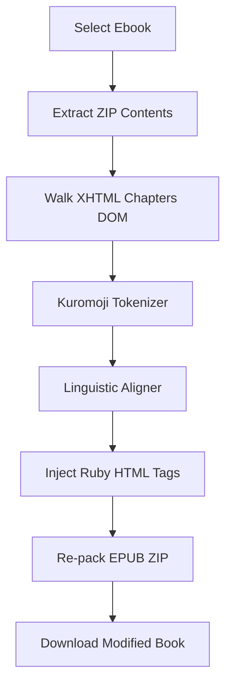

# 📖 RubyMarker

RubyMarker is a simple web app that automatically adds furigana (ruby characters) to DRM-free Japanese EPUB ebooks, right in your browser. 

It tokenizes your EPUB chapters locally, checks the kanji against your reading level, and inserts readings for the words you might not know yet.

## Live Demo

A live version of RubyMarker is hosted and available online at:
👉 **[https://ruby.marksfine.site/](https://ruby.marksfine.site/)**

Just like running it locally, the online version is completely client-side. Your books are processed in your browser and never leave your computer.

---

## Features

*   **Runs Locally**: All ZIP parsing, text tokenization, and ebook compilation happen inside your browser. Your ebooks are processed locally and never uploaded to any server.
*   **Kanji Level Filtering**: Choose your JLPT level (N5 up to N1), all kanji, or Joyo-only. Furigana will only be added to kanji above your selected level.
*   **Furigana Repeat Rules**:
    *   *Reset per Chapter*: Resets the memory of seen words at the start of each chapter.
    *   *Reset by Character Gap*: Shows the reading again if a word hasn't appeared for a set number of characters (defaults to 1,500).
    *   *No Reset*: Adds readings to every single occurrence of target kanji.
*   **Known Words List**:
    *   Drag and drop books you have already read to count word frequencies and mark them as known.
    *   Skip known words in new books so you aren't distracted by readings for words you already know.
    *   Search, sort, or export/import your word list as a JSON backup.

---

## How It Works



1.  **Parsing & Tokenization**: RubyMarker unzips your EPUB using `JSZip` and parses the chapters. It uses a browserified version of the `kuromoji` library to split the text into words and identify their readings.
2.  **Linguistic Mapping**: A backtracking alignment helper maps kanji portions of a word (e.g. `入り込む`) to their corresponding kana readings (e.g. `はいりこむ`), making sure to handle sound changes like *Rendaku* (voicing) and *Sokuon* (double-consonant shortening).
3.  **HTML Insertion**: Instead of simple text replacement that can break formatting, it uses a DOM parser to traverse raw text nodes safely, leaving existing HTML styling, images, and other tags intact.

---

## Running It Locally

### Prerequisites
*   [Node.js](https://nodejs.org/) (v18 or higher)
*   [npm](https://www.npmjs.com/)

### Setup

1.  **Clone this repo**:
    ```bash
    git clone https://github.com/Learz/RubyMarker.git
    ```

2.  **Install dependencies**:
    ```bash
    npm install
    ```
    *Note: This automatically runs a script to fetch a kanji dictionary list and copy the kuromoji dictionary files into the `public/` folder.*

3.  **Start the dev server**:
    ```bash
    npm run dev
    ```
    Open **[http://localhost:5173](http://localhost:5173)** in your browser.

4.  **Build production version**:
    ```bash
    npm run build
    ```

---

## Codebase Layout

```
RubyMarker/
├── public/                 # Static files
│   ├── dict/               # Morphological dictionary files (15MB)
│   └── js/                 # Kuromoji runtime script
├── scripts/
│   └── setup-assets.js     # Post-install database compilation script
├── src/
│   ├── components/         # React panels
│   │   ├── Dashboard.tsx    # Drag-and-drop file uploader and progress bar
│   │   ├── SettingsPanel.tsx# Kanji level and repetition sliders
│   │   └── VocabBuilder.tsx # Vocabulary database listing and file parsing
│   ├── data/
│   │   └── kanji-data.json # Joyo & JLPT levels data file
│   ├── utils/
│   │   ├── aligner.ts      # Reading-to-kanji alignment logic
│   │   ├── epubProcessor.ts# Ebook zipper and DOM traversing
│   │   ├── kanjiDb.ts      # Kanji database helpers
│   │   └── vocabDb.ts      # Word local storage database helper
│   ├── App.tsx             # Theme toggler and layout router
│   ├── index.css           # Styling sheets and theme definitions
│   └── main.tsx            # App root
```
